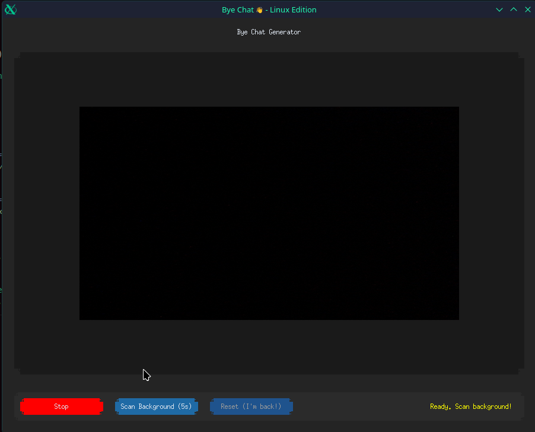

# 👋 Bye Chat (Linux Edition)

**A lightweight Python tool for Linux that lets you fade out of reality like the famous meme just by showing a peace sign.**

> **Note:** MediaPipe currently works best with Python 3.10 - 3.12. If you are on Python 3.13 (e.g. Arch/CachyOS), consider pinning your environment to 3.12 using `uv python pin 3.12`.



Designed for **Linux** (tested on CachyOS/TuxedoOS), utilizing `v4l2loopback` to feed the modified video stream directly into Discord, Zoom, Teams, or Google Meet.

## ✨ Features

- **✌️ Gesture Trigger:** Detects a peace sign using MediaPipe.
- **👻 Ghost Fade:** Smoothly fades your body out while keeping the static background.
- **🛡️ Privacy Mode:** Becomes a "clean plate" of your room when you are gone.
- **🐧 Linux Native:** Built with `pyvirtualcam` and `customtkinter` for a modern Linux desktop experience.
- **⚡ Fast:** Optimized threading to separate video processing from the GUI (no flickering).

## 🛠️ Prerequisites

You need a Linux system with **v4l2loopback** installed to create a virtual camera device.

### Arch Linux / CachyOS / Manjaro
```bash
sudo pacman -S v4l2loopback-dkms v4l2loopback-utils
```

### Debian / Ubuntu / TuxedoOS

Bash

```
sudo apt install v4l2loopback-dkms v4l2loopback-utils
```

### Enable the Virtual Device

Before running the app, load the kernel module (creates `/dev/video20`):

Bash

```
sudo modprobe v4l2loopback devices=1 video_nr=20 card_label="ByeChatCam" exclusive_caps=1
```

_(Tip: You can make this permanent by adding a config file to `/etc/modprobe.d/`)_

## 📦 Installation

This project uses [uv](https://github.com/astral-sh/uv) for fast dependency management.

1. **Clone the repository**
    
    Bash
    
    ```
    git clone [https://github.com/YOUR_USERNAME/bye-chat.git](https://github.com/YOUR_USERNAME/bye-chat.git)
    cd bye-chat
    ```
    
2. **Install dependencies & Run**
    
    Bash
    
    ```
    uv run main.py
    ```
    
    _Alternatively, using standard pip:_
    
    Bash
    
    ```
    pip install -r requirements.txt
    python main.py
    ```
    

## 🚀 How to Use

1. **Start the App:** Run the script. You will see the control window.
    
2. **Start Camera:** Click the green **"Start Camera"** button.
    
3. **Configure Meeting App:** Open Discord/Zoom and select **"ByeChatCam"** as your camera.
    
4. **Scan Background (Important!):**
    
    - Click **"Scan Background"**.
        
    - You have 5 seconds to **move out of the frame**.
        
    - The app needs to "learn" what your room looks like empty.
        
5. **Bye Chat:** Come back into the frame. Show a **Peace Sign ✌️** to the camera.
    
6. **Reset:** Click the blue **"Reset"** button to reappear instantly.
    

## 🔧 Troubleshooting

- **"Device /dev/video20 does not exist":** Make sure you ran the `sudo modprobe` command listed in Prerequisites.
    
- **Discord shows a black screen:** Ensure the app is running and "Start Camera" is active _before_ you open Discord's video settings.
    
- **Flickering GUI:** The app uses a threaded GUI update loop. If it flickers, your system might be under heavy load, but the stream to Discord should remain smooth.
    